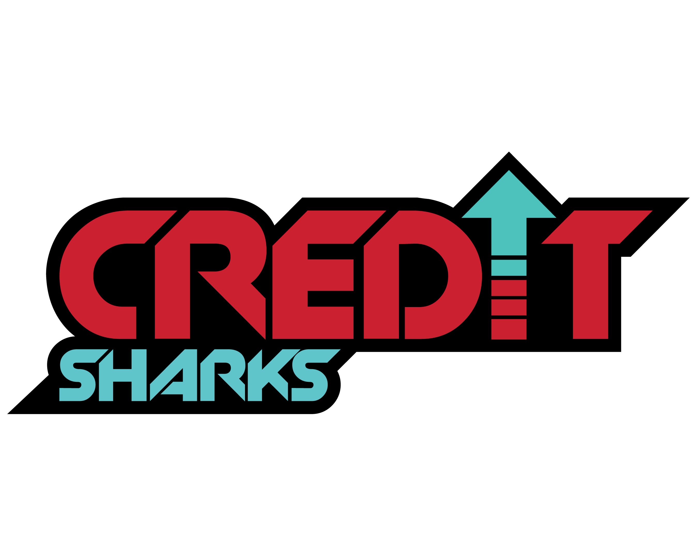
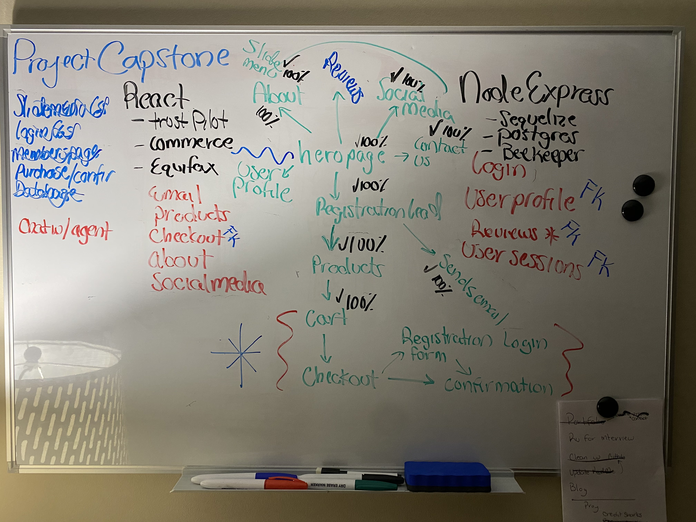
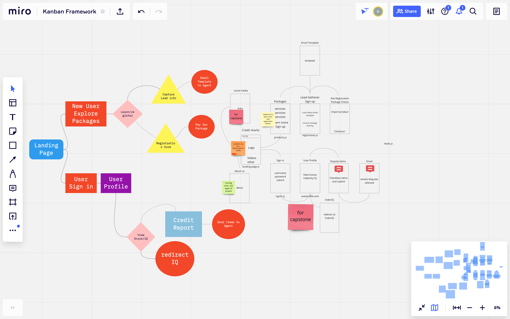

PSA: The Credit Shark LLC has moved on to new businesses and thus the website is no longer active. He has commissioned me to create "SunnyBnBs". Coming soon.

## Creator's Notes

CreditSharks LLC approached me with an opportunity to create for them an E-shop for them to sell their packages. The app centers around the ability to use Stripe api to perform transactions for customers. The app also houses a user profile section for users to interact with the agent. This app will go ito full production and will receive continous updates past the Capstone project date.

## The Goal
To create a working E-shop that allows transactions and product viewing. In addition the ability to contact the merchant via in-app email.

## The Journey
Though this was not my first React app, it is my first Client/Server app. Here was my process.

I started with a personal whiteboard to help me decide all the components and routes I would need for both client and server side.

I use a Kanban board to visualize the layout and flow of the app.

  
## Challenges & Solutions
Had some issues with Stripe API and their keys. Styling Stripe was also difficult due to various constraints on their class components. Using Material UI was a challenge when combining my own CSS. Had a lot of issues with models and login. Login function was not recognizng email key pair and would not update the DB. Worked around with userName.

## Creator

- David Vaughan (dave the dev)
